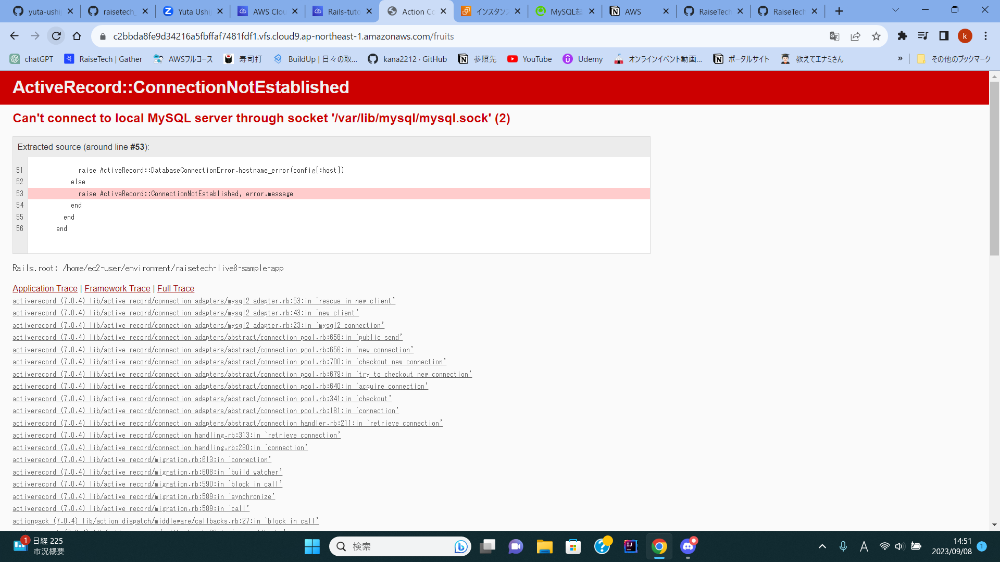

# 第3回課題  
Ruby on RailsによるサンプルアプリケーションをCloud9でデプロイする。  
- アプリケーション接続確認  
  
- APサーバーの名前とバージョン確認  
```puma --version```と入力して```puma version5.6.5```と確認が出来る。  
- APサーバーを```Ctrol + C```で終了させてアクセスした場合 
 
再び```rails s```コマンドで再起動すると正常に接続できる  
- DBエンジンの名前とバージョン確認  
```mysql --version```と入力して```mysql ver 8.0.34```と確認が出来る。  
- DB接続を```sudo service mysql stop```で終了した場合のアクセス画面  
  
再び```sudo service mysql start```すると接続成功する。  
- Railsの構成管理ツールの名前  
 Bundler  
- 今回の課題から学んだこと  
Cloud9から画像を添付する方法を知った。デプロイまでの過程で悩んだのは、MySQLのソケット通信が出来なくて焦ったが、講座の動画を見ながらなんとか続けて
デプロイ完了することに成功した。```less /etc/myconf```コマンドがタイプミスで詰まっていただけだと分かった。
socket通信を成功させるにはdatabase.ymlファイルのsocketに上記のコマンドで分かったパスを書き、testにも同じ記述を忘れない事。
