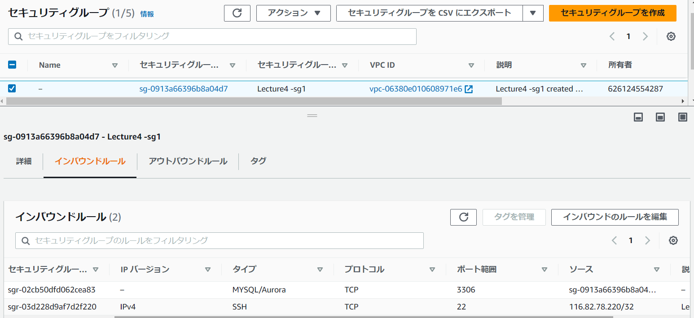
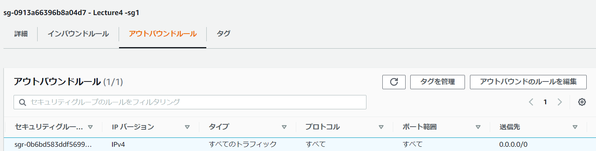
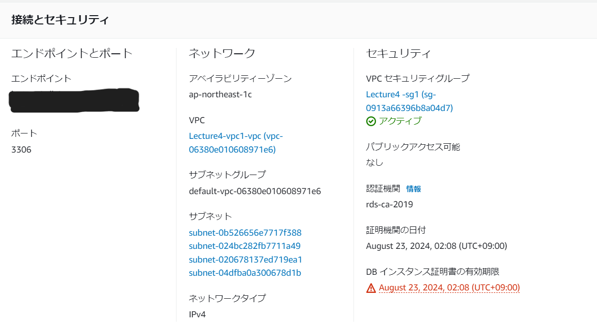

# 第4回課題  
EC2からRDSへ接続し、正常であることを確認する。  
  
- VPC新規作成  
 

  
- EC2作成  

  
  
- インバウンドルール  
  
  
  
- アウトバウンドルール  
  
  

- RDS作成  

  
  
- RDSセキュリティグループルール  
  
  
  
- EC2からRDSへ接続確認  
  
  
  
 - ## 今回の学び  
インバウンドルール設定の部分でRDSとEC2は同一VPC内に存在するので、RDSのセキュリティグループのインバウンドで許可するのはEC2のセキュリティグループIDでないと
mysqlのパスワードを入力しても先に進めない事が分かった。
SSHのインバウンドルール設定はMyIPにしてセキュリティを上げる事に注意する。
