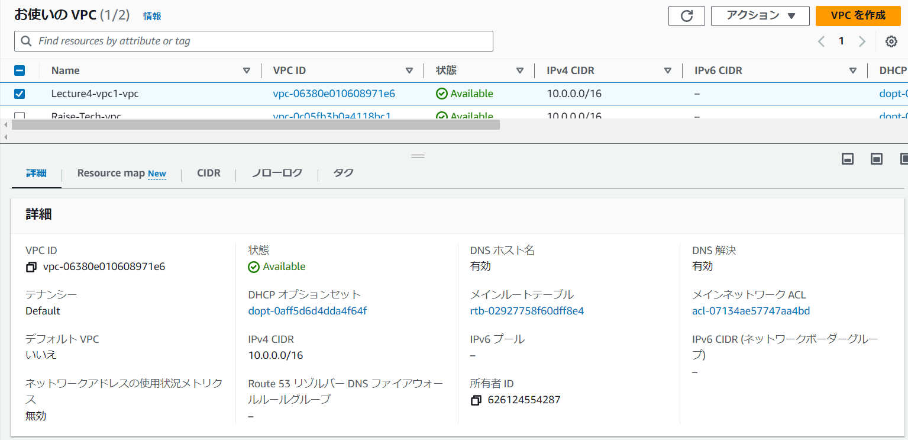
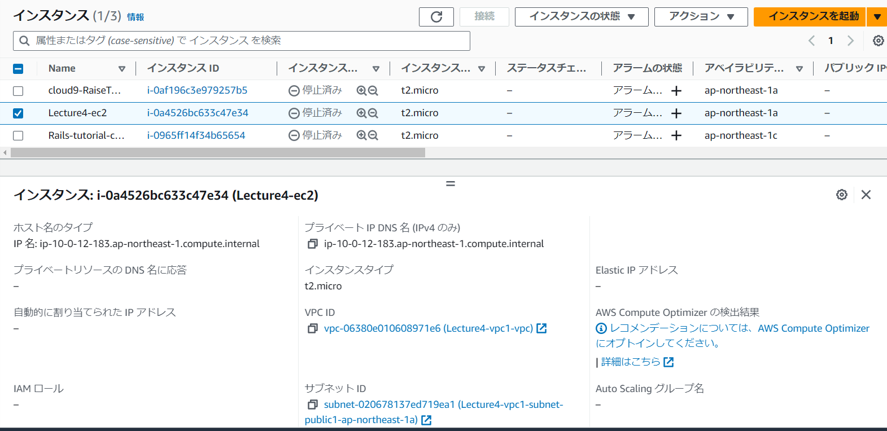
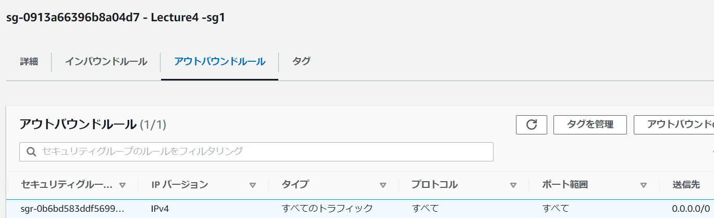
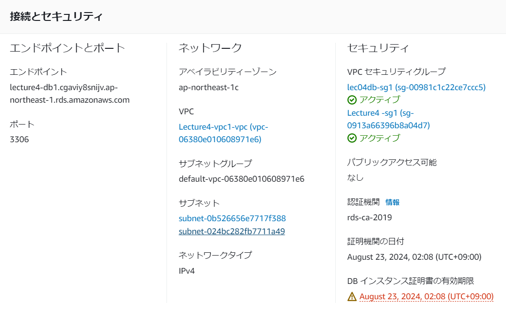
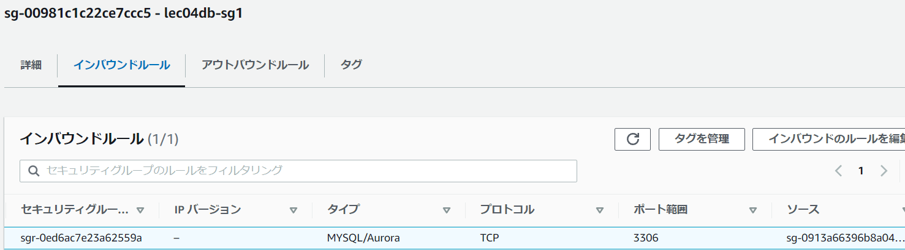
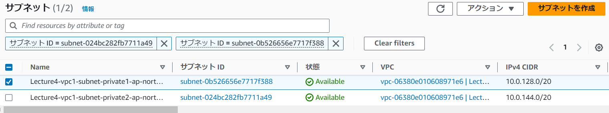
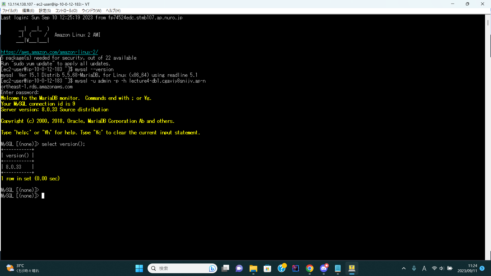

# 第4回課題  
EC2からRDSへ接続し、正常であることを確認する。  
  
- VPC新規作成  
 

  
- EC2作成  
  
インバウンドルール  

  
  
- アウトバウンドルール  
  
  

  
- RDS作成  

  
  
- RDSインバウンド  
  

  
- サブネット  
パブリックサブネットを含んでいた為修正  

  
- EC2からRDSへ接続確認  
  
  
  
 - ## 今回の学び  
RDSのサブネットグループはプライベートである事。インバウンド・アウトバウンドルールの理解がまだ甘いことを実感した。
分からなくなる前に図を描きながら進める事、
SSHのインバウンドルール設定はMyIPにしてセキュリティを上げる事に注意する。
