# 第5回課題  

第4回課題で作成したEC2、RDS、VPC、サブネット、AZをそのまま使用し、第3回のCloud9でデプロイしたサンプルアプリをEC2でデプロイする。
起動確認が取れたらALBとS3を追加し、構成図を書いてみる。

## Pumaのみで動作確認  

Ruby,Node,yarn,bundler,mysql,Gitをインストールし、database.ymlファイルにRDSのエンドポイントを指定して先ずはPumaのみで動作確認する。
セキュリティグループのインバウンドルールはポート3000を開放する。

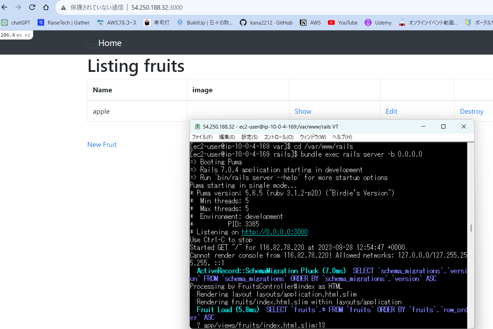  

## Nginxを追加して動作確認する。  

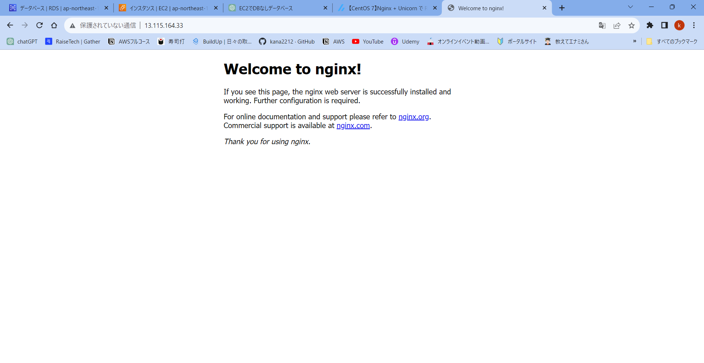  

## Unicornのみで動作確認  

セキュリティグループのポート3001をテスト用に開放し、unicorn.rbファイルに
```listen 3001```を記述し動作確認する。  

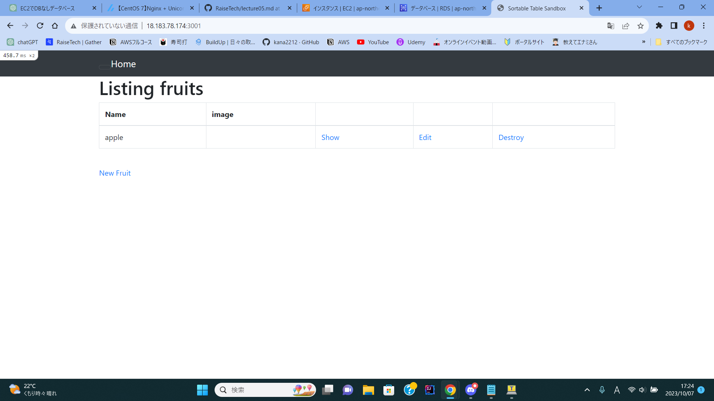  

## Unicorn+Nginxを連携して動作確認  

UnicornとNginxのソケットのパスが合っていないとエラーが起こる。

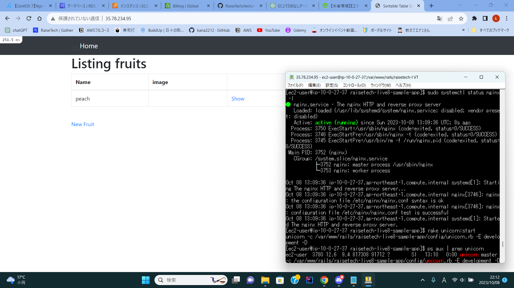  

## ALB追加  

DNS名を取得できるのでこれを使用してブラウザで接続確認をする。  

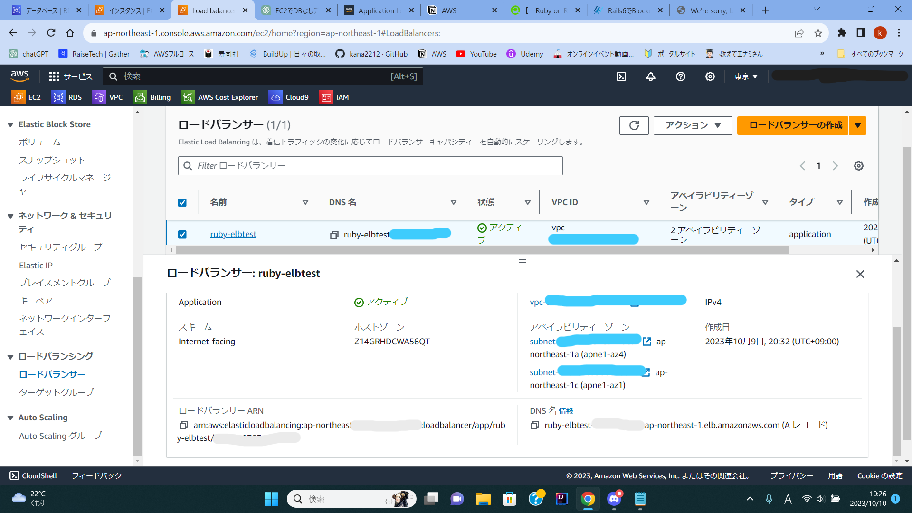  

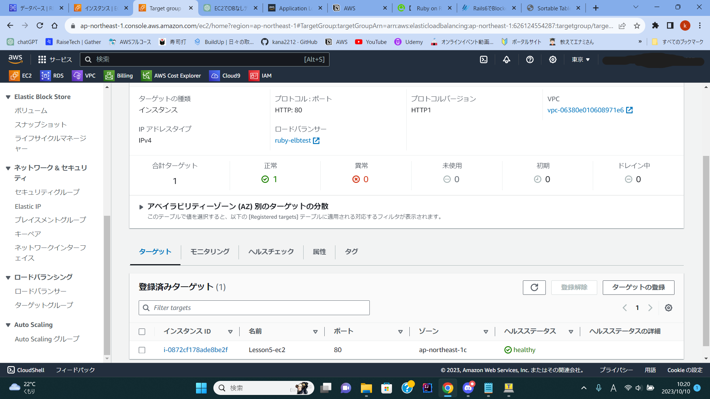  

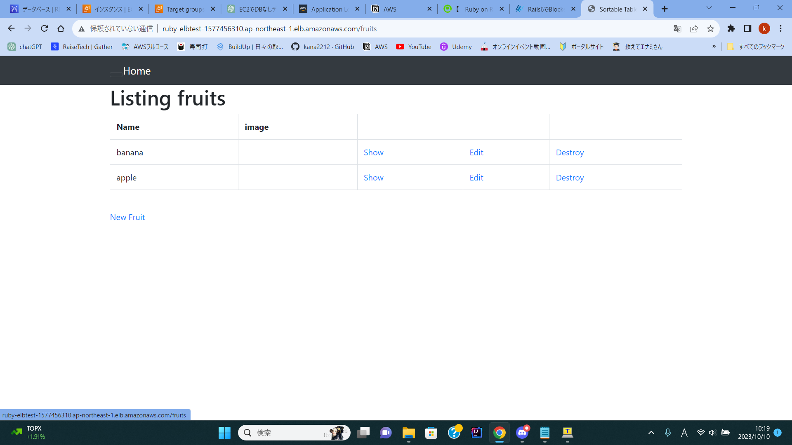  

## I AMロールを設定しS3へ接続する  

ポリシーは「S3FullAccess」をアタッチしてアクセスキー。シークレットキーの代わりとし、EC2インスタンスに割り当てる。
EC2からS3へ接続確認する。

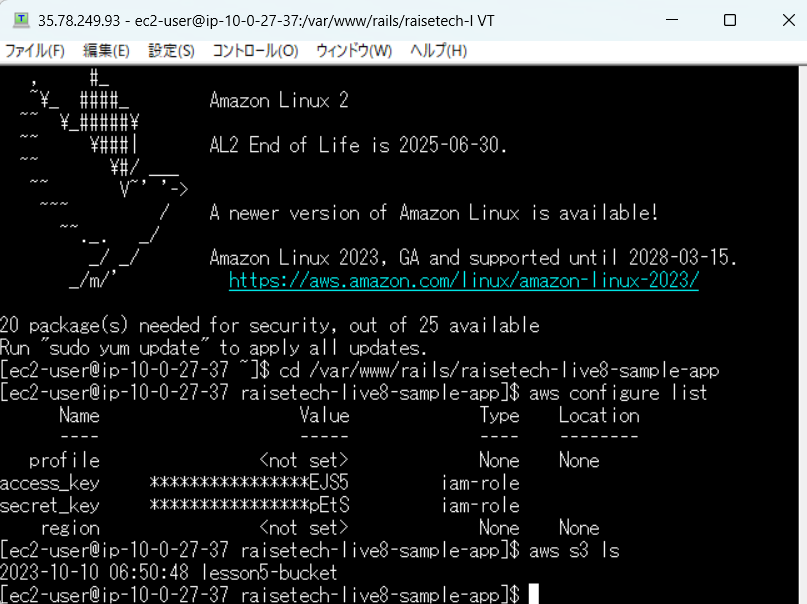  

## 画像保存に成功  

S3のバケットを作成し、ブラウザから画像を登録して無事に反映されるか確認する。

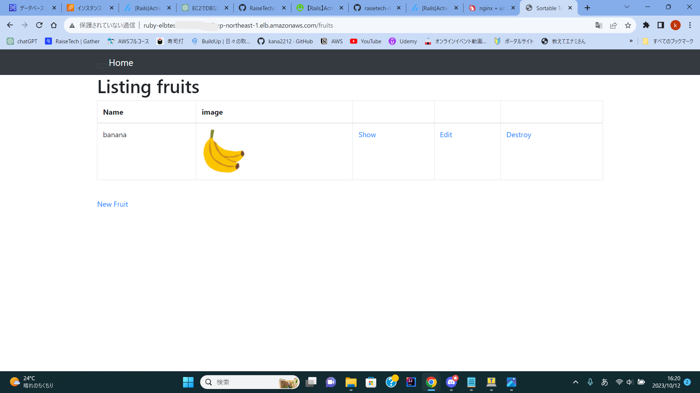  

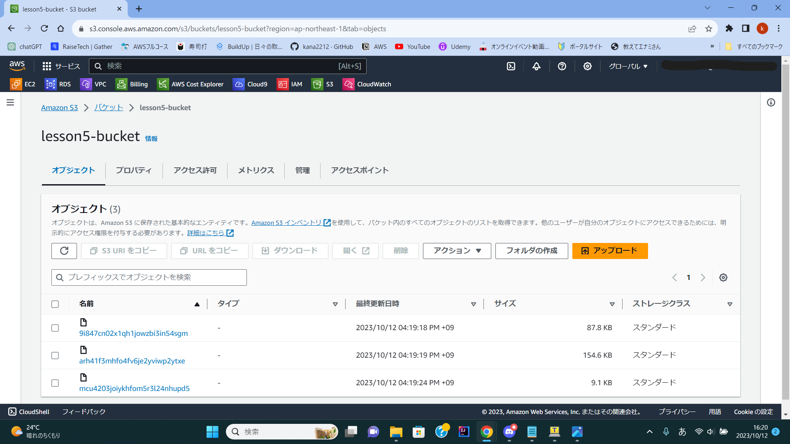  

## 構成図作成  

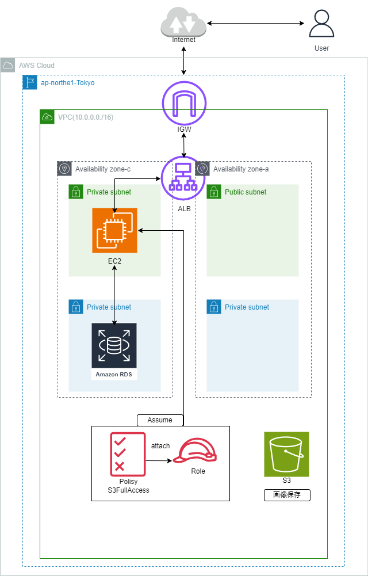  

## 今回の学び  


S3はキャッシュが出ない為、Puma,Nginx,Unicornと起動を分けてそれぞれのエラーログを見る事が大事。
初めに権限も付与する事で余計なエラーに遭遇しなくなった。
今回はシークレットキー、アクセスキーを使用しない方法で実行したのでこの辺りの事も学んでおきたい。
