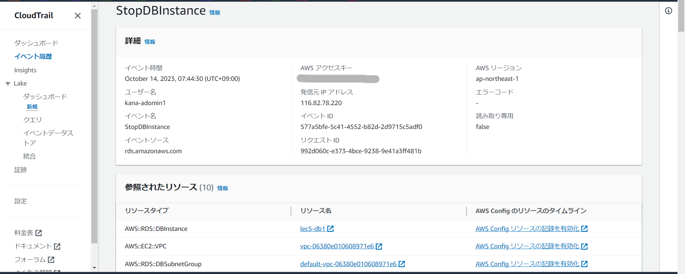
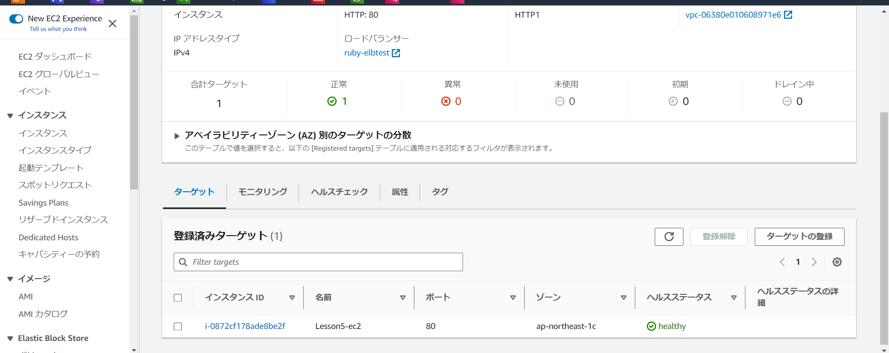
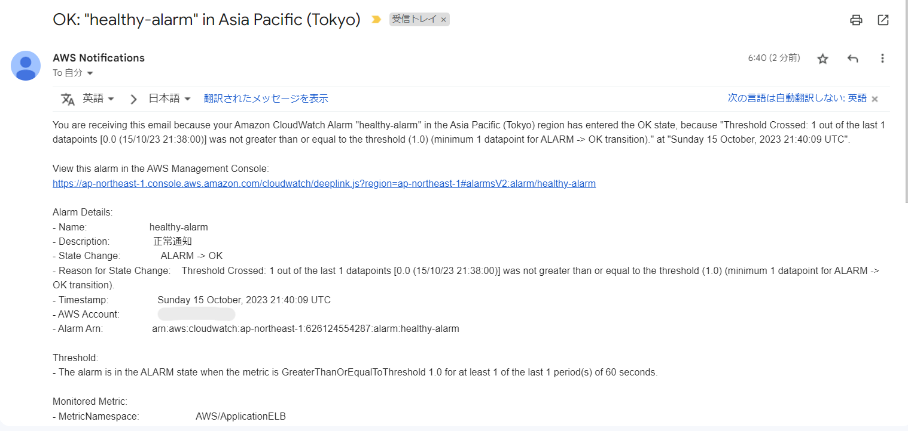
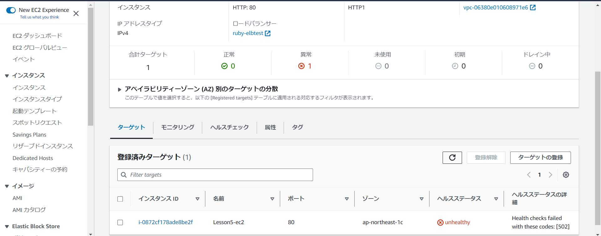
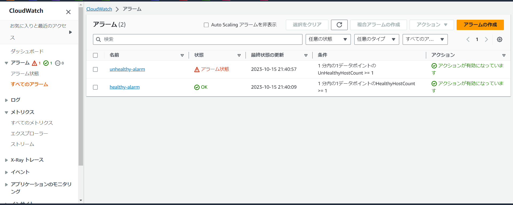
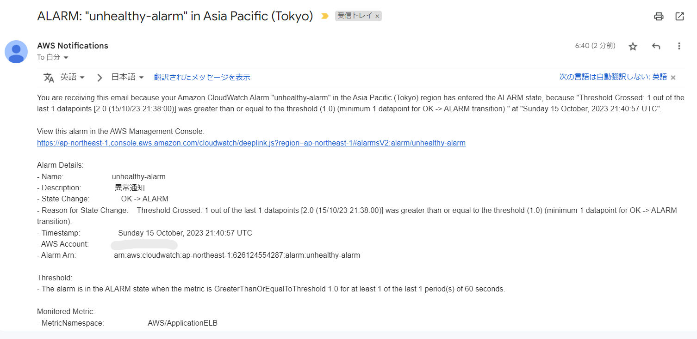
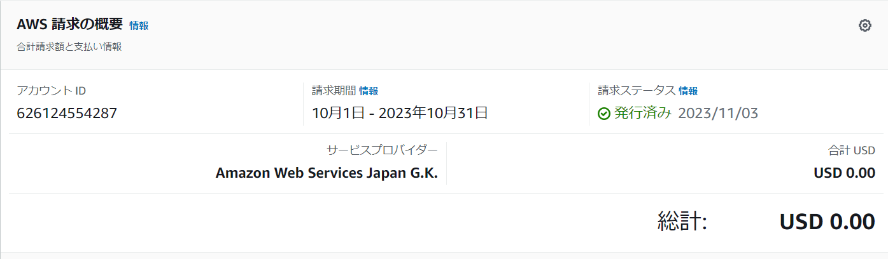
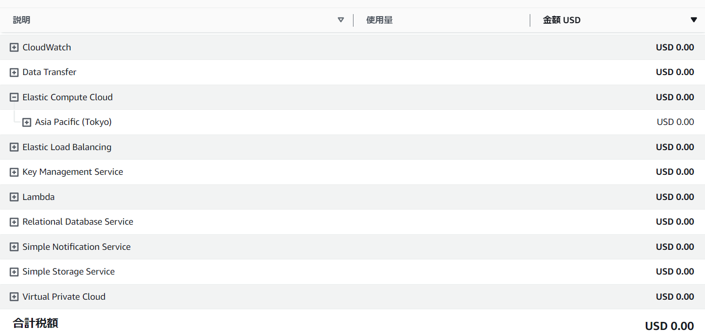

# 第6回課題  

・Cloud TrailからI AMユーザー名でAWSを利用した記録を探す  

イベント名と含まれている内容を3つピックアップする

  

・イベント名:  StopDBInstance  
・リージョン:ap-northeast-1  
・イベントソース:  rds.amazonaws.com
  
 ## CloudWatchアラームを使ってALBのアラームを設定、メールを通知する  
 
・アプリケーションがhealthyの場合  

  

  

  

・アプリケーションがunhealthyの場合  

  

  

  

## AWS利用料の見積もり作成  

・これまでに作成したリソース内容で見積もりを作成する  
[見積もりはこちら](https://calculator.aws/#/estimate?id=01333c8c2a6d8c3eb12f3a3e815ffd14da199ba6
)  

## マネジメントコンソールから自分の請求の確認  

先月の請求

  

EC2のコスト  

  

